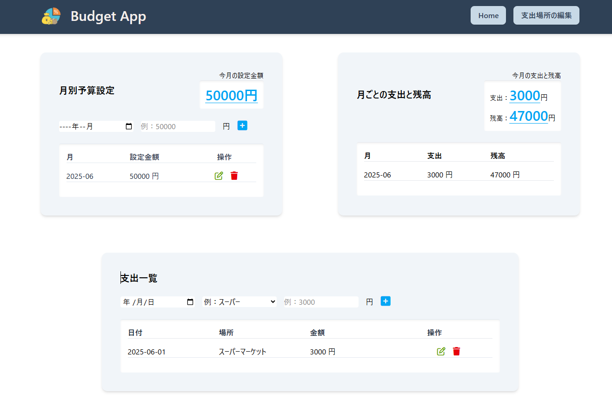
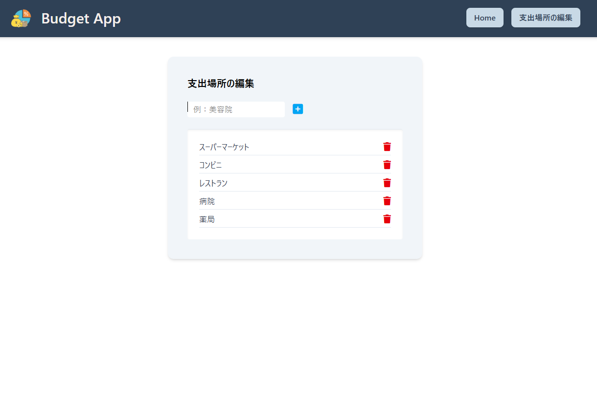

# Budget App

---

## はじめに

1 ヶ月間の支出を記録し、決めた予算内でやりくりすることをサポートする家計管理アプリです。  
「どれくらい使ったか？」「予算を超えていないか？」が一目でわかる設計です。

---

## アプリを作ったキッカケ

**私自身が必要だと思ったから開発しました。**

- 1 ヶ月間でどれくらい使っているかを把握できる
- 決められたバジェットの中でどうやりくりするか考えることができる
- 金銭感覚を磨ける
- 無駄遣いをせずに貯金を増やせる
- 無駄な出費があったら一目でわかる

毎月の支出を見直すことで、より健全な家計管理を目指せます。

---

## 使用技術・ライブラリ

- **React 19**
- **Vite**
- **Tailwind CSS 4**
- **React Router DOM v7**
- **UUID**
- **Firebase**
  - Hosting

---

## ■ 機能概要

| 機能                        | 説明                                                       |
| --------------------------- | ---------------------------------------------------------- |
| 💸 月ごとの予算設定         | カテゴリごとに毎月の予算を設定できます                     |
| 🧾 支出の記録               | 日々の支出を簡単に記録＆表示                               |
| 📊 残額の自動計算           | 予算に対して残りいくら使えるかを自動計算                   |
| 📅 月別の一覧表示           | カレンダー形式や月単位での支出確認が可能                   |
| 🗺️ 支出場所の管理　　　　　 | よく使う店舗や場所を記録＆分類可能　　　　　　　　　　　　 |

---

## ■ 画面イメージ

---

## ■ 今後のアップデート

- 月ごとの支出をグラフ化 | 視覚的に支出バランスを把握できる円グラフや棒グラフを追加予定
- 通年グラフの追加 | 年間の支出推移を確認し、長期的な家計管理に役立てられるようにする
- すべてを削除するリセット機能

---

## ■ リンク先

[Budget App](https://budget-app-cf5dc.web.app/)

---
